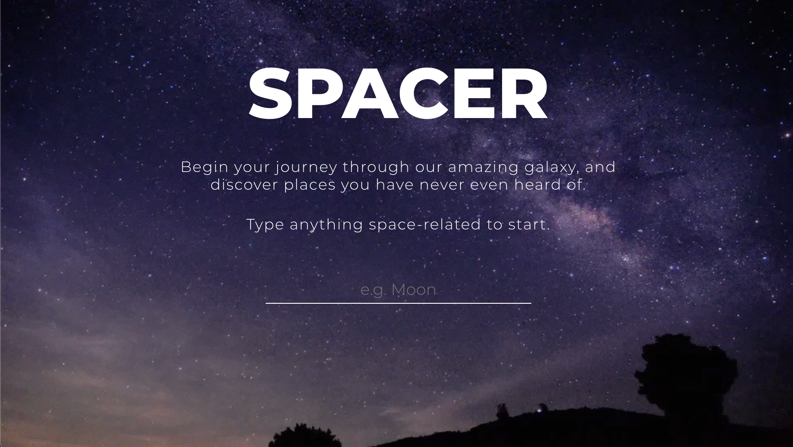

# NASA Gallery Explorer
Single Page Application - Explore NASA gallery API by searching any keyword you think of.

Built on Vue.js Single Page Application project

Web address: https://optimistic-joliot-df879a.netlify.app/



## Project setup
```
yarn install
```

### Compiles and hot-reloads for development
```
yarn run serve
```

### Compiles and minifies for production
```
yarn run build
```

### Lints and fixes files
```
yarn run lint
```

### Run your unit tests
```
yarn run test:unit
```
